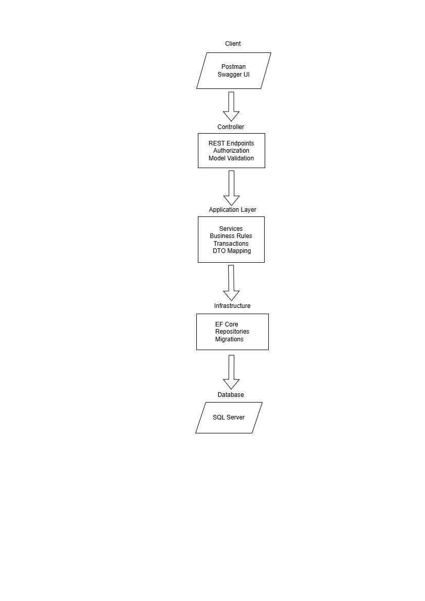

## Online Store API
A production-style backend API for managing an online store, designed to simulate real-world e-commerce challenges such as secure authentication, data consistency during financial operations, scalable architecture, and maintainable business logic.
This project focuses on building a reliable and extensible backend system while applying modern software engineering practices and clean architectural patterns.
---
## Project Purpose
Most beginner e-commerce projects focus only on CRUD operations.
This project was built to solve real backend challenges commonly found in production systems:
- Managing secure user authentication and authorization
- Handling complex business workflows such as order processing and payments
- Preventing inconsistent or corrupted data during transactional operations
- Maintaining scalable and testable backend architecture
- Providing unified and predictable API responses for frontend integration
---
## What I Learned From This Project
- Designing scalable backend architectures
- Handling transactional business workflows
- Applying clean code and separation of concerns
- Building secure authentication systems using JWT
- Structuring service layers for maintainability
- Designing consistent API response contracts
- Managing relational database integrity using EF Core
---
## Layers Overview
<p align="center">
  
</p>

---
## Features
- JWT Authentication and Role-based Authorization
- Product, Category, and Order management
- Validation and error handling with `ServiceResult`
- Entity Framework Core + SQL Server
- Dependency Injection
- DTOs and layered architecture
---
## Technologies Used
- ASP.NET Core 8 | Entity Framework Core | SQL Server | AutoMapper | JWT Authentication
---

## Watch The API Test

- https://www.youtube.com/watch?v=Sz1T1BKzy28&t=117s

## How to Run Locally
### 1️⃣ Download the Project:
You can either **clone** or **download it manually**:
- **Option 1 (recommended):**  
  In Git Bash, run:  
  ```bash
  git clone https://github.com/chikolaid6-cell/E-CommerceAPI.git
Option 2:
Click Code → Download ZIP, then extract it.
### 2️⃣ Navigate to the Project Folder:
cd E-CommerceAPI
### 3️⃣ Create or Update appsettings.json:
Copy from appsettings.example.json and set your connection string and JWT key.
### 4️⃣ Apply Database Migrations:
dotnet ef database update
### 5️⃣ Run the API:
dotnet run

Chikh Oulad Laid
Backend Developer — ASP.NET Core
[LinkedIn](www.linkedin.com/in/chikhouladlaid) | [GitHub](https://github.com/chikh97laid)
